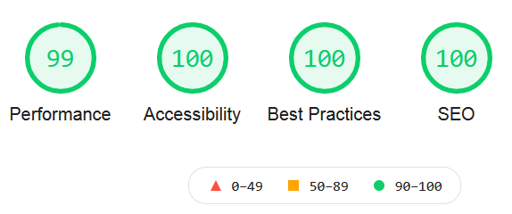
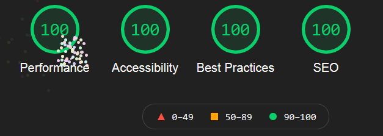
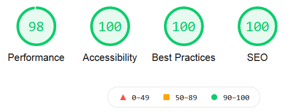
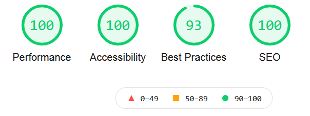
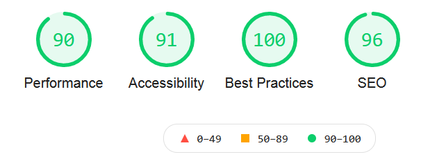
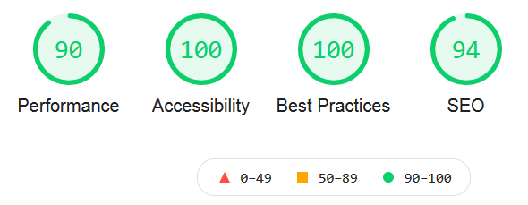
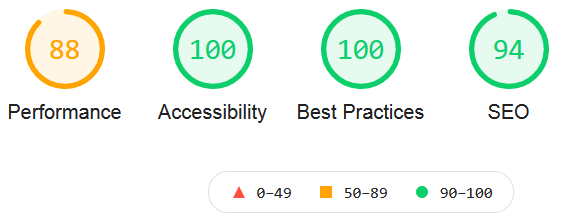
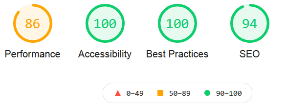
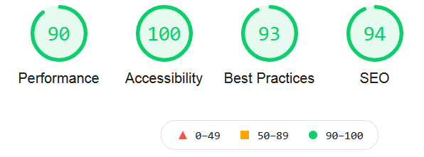
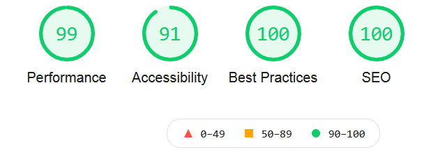

# Legend Of The Greek Gods

Visit the deployed site: [Legend of the Greek Gods](https://manni8436.github.io/Legend-of-the-Greek-Gods/)

## INITIAL DESIGN

My initial idea for this project was to create an informative website about the Greek Gods. My target audience is anyone interested in Greek Mythology, this can cover a huge spectrum of ages, genders and interest levels. This ranges from children who want to learn about the Greek Gods, to anyone who wants to use the site for projects, to those who just want to read something fun and interesting.

* The main features that I wanted to include are:

* Easy to use navigation menu.
* Easy to read information.
* A black and gold colour scheme that stands out, but is not overwhelming.

## CONTENTS

* [User Experience](#user-experience)
  * [User Stories](#user-stories)
* [Design](#design)
  * [Color Scheme](#color-scheme)
* [Wireframes](#wireframes)
* [Technologies Used](#technologies-used)
  * [Languages Used](#languages-used)
  * [Programs Used](#programs-used)
* [Deployment](#deployment)
  * [Initial Deployment](#initial-deployment)
  * [How To Fork A Repository](#how-to-fork-a-repository)
  * [How To Clone A Repository](#how-to-clone-a-repository)
  * [How To Make A Local Clone](#how-to-make-a-local-clone)
* [Testing](#testing)
  * [Code Validators](#code-validators)
* [Content](#content)
  * [Images](#images)
  * [Text Content](#text-content)
* [Acknowledgement](#acknowledgement)

## USER EXPERIENCE

The structure of the site was designed to be simple and easy to use and have a good content balance to not overload the user and give them enough information to not leave them lost or needing more knowledge.

* The website is for the following user types:

* Users that have no previous knowledge of the stories, history, or characters and see what they used to look like.
* Users with basic knowledge of Greek history, who were looking for more information and to increase their knowledge base.
* Users who have good knowledge of Greek history but want to refresh their knowledge and do some research or even just enjoy reading about the history of all the gods.

## USER STORIES

### CLIENT GOALS

* The site needs to be easily accessible.
* The navigation menu needs to be simple to use on a range of devices, including desktop, tablet and mobile.
* Maneuvering around the site should be straightforward.
* The site should be informative and all the text should be easy to read.
* The images should be clear and not stretched or squashed.

#### FIRST TIME VISITORS

* I want it to be easy to understand how to navigate throughout the site.
* I want the content to be easily read and understandable.

#### RETURNING USER

* To gather information for projects.
* To recommend the site to friends and family.
* To get in contact with us

## DESIGN

### COLOR SCHEME

My overall color scheme used throughout the site was gold and slightly off-black.

I chose these colours for my theme to represent the high status of the gods, which have been known to use gold in clothes, buildings, money and plenty of other items, I chose the off-black color to make the gold color stand out on the site.

 I also used white text in the forms section on the [Contact Us](https://manni8436.github.io/Legend-of-the-Greek-Gods/contactus.html) page.

## WIREFRAMES

[Here are my wireframes for desktop, mobile and tablet for this project](assets/wireframes/MSProject1Wireframes.pdf)

## FEATURES

I have used the following features in this project:

* Hover
* Tells the user the location of the mouse whilst navigating the menu.
* Helps the user not lose their place.

* Contact Form
* Form validation requests the user to input the correct information in the input fields.
* Avoids the user accidentally sending blank or incomplete forms.

## SOLVED BUGS

* None of the background images fit on the screen properly, especially on the home page (the top of the image was getting cut off). As a result, I changed the `background-position` from `background-position: center center;` to `background-position: top center;`

* I ran my code through W3C validators, and I was given an error of `duplicate attribute class`. After closer inspection of this issue, I added `img-fluid` and `d-block w-100` all into one `class=" "`, rather than splitting it between multiple `class=" "`. I then rechecked all pages through the W3C Code Validator and there were no further errors.

## TECHNOLOGIES USED

### LANGUAGES USED

 

### PROGRAMS USED

#### Font Awesome

[Font Awesome](https://fontawesome.com/) was used for a few icons in the footer on all of this site's pages.

#### Google Fonts

[Google Fonts](https://fonts.google.com/) was used for all the text content on the site pages.

#### Git

Git was used for version control by using the Gitpod terminal to add and commit to GIt and push to Github.

#### GitPod

GitPod was used as an IDE whilst coding this site.

#### GitHub

GitHub is being used to store all the code for this project after being pushed from GitPod.

#### Am I Responsive

[Am I Responsive](http://ami.responsivedesign.is/) was used to create the image in my [Final Design](#final-design) section.

#### Balsamiq

Balsamiq was used in the initial design process to make wireframes.

#### Firefox Developer Tools

Firefox Developer Tools was used for troubleshooting and trying new visual changes without affecting the current code.

## DEPLOYMENT

### INITIAL DEPLOYMENT

This site was deployed using GitHub Pages with the following steps below:

1. Login or Sign Up to [GitHub](www.github.com).
2. Create a new repository named "MS1-Project".
3. Once created, click on "Settings" on the navigation bar under the repository title.
4. Click on "Pages", on the left-hand side below Secrets.
5. Under "Source", choose which branch you wish to deploy, In most cases, it will be "main".
6. Choose which folder to deploy from, generally from "/root".
7. Click "Save", then wait for it to be deployed. It may take some time for the page to be fully deployed.
8. The URL will be displayed above the "source" section in GitHub Pages.

### HOW TO FORK A REPOSITORY

If you need to make a copy of a repository:

1. Login or Sign Up to [GitHub](www.github.com).
2. On GitHub, go to [manni8436/MS1-Project](manni8436/MS1-Project).
3. In the top right corner, click "Fork".

### HOW TO CLONE A REPOSITORY

If you need to make a clone:

1. Login to [GitHub](www.github.com).
2. Fork the repository manni8436/MS1-Project using the steps above in [How To Fork a Repository](#how-to-fork-a-repository).
3. Above the file list, click "Code".
4. Choose if you want to close using HTTPS, SSH or GitHub CLI, then click the copy button to the right.
5. Open Git Bash.
6. Change the directory to where you want your clone to go.
7. Type git clone and then paste the URL you copied in step 4.
8. Press Enter to create your clone.

### HOW TO MAKE A LOCAL CLONE

If you need to make a local clone:

1. Login to [GitHub](www.github.com).
2. Under the repository name, above the list of files, click "Code".
3. Here you can either Clone or Download the repository.
4. You should close the repository using HTTPS, clicking on the icon to copy the link.
5. Open Git Bash.
6. Change the current working directory to the new location, where you want the cloned directory to be.
7. Type git clone and then paste the URL you copied in step 4.
8. Press Enter, and your local clone will be created.

## TESTING

### CODE VALIDATORS

The W3C Markup Validator and W3C CSS Validator were used to validate my project to make sure there were no errors within the site.

* W3C HTML Validator Results
* [Home Page](https://validator.w3.org/nu/?doc=https%3A%2F%2Fmanni8436.github.io%2FMS1-Project%2Findex.html)
* [Big Three](https://validator.w3.org/nu/?doc=https%3A%2F%2Fmanni8436.github.io%2FMS1-Project%2Fthebigthree.html)
* [Lesser Known Gods](https://validator.w3.org/nu/?doc=https%3A%2F%2Fmanni8436.github.io%2FMS1-Project%2Flesserknowngods.html)
* [History](https://validator.w3.org/nu/?doc=https%3A%2F%2Fmanni8436.github.io%2FMS1-Project%2Fhistory.html)
* [Contact Us](https://validator.w3.org/nu/?doc=https%3A%2F%2Fmanni8436.github.io%2FMS1-Project%2Fcontactus.html)

* W3C CSS Validator Results
* [CSS](http://www.css-validator.org/validator?uri=https%3A%2F%2Fmanni8436.github.io%2FMS1-Project%2Findex.html&profile=css21&usermedium=all&warning=1&lang=en)

### FULL TESTING

[Click Here](testing.md) to view the full testing steps that were completed on every device and browser.

### LIGHTHOUSE

* I tested my website using the Firefox Developer Tools Lighthouse feature, and received the results below:

### DESKTOP

* Home Page

* The Big Three

* Lesser Known Gods

* History

* Contact Us

### MOBILE

* Home Page

* The Big Three

* Lesser Known Gods

* History

* Contact Us

#### Performance

* I was very happy with my initial lighthouse scores.
* The issues reducing my performance scores are that I have a lot of images, including background images on all pages and also a huge amount of content on four pages.
* My mobile scores are lower due to the scaling down of images and text for use on mobile.

#### Accessibility

* While writing my code, I was careful to ensure that it was fully accessible.
* Every image has the relevant alt text applied to it.
* All text has good visibility on the background I chose.

#### Best Practices

* All images are shown in the correct aspect ratio, so as not to look stretched or pixelated.

#### SEO

* I ensured the site had all the relevant meta tags needed.
* All font sizes are legible on all screen sizes.

## CONTENT

### IMAGES

* Images are mainly provided by Wikipedia and Pinterest, but a full list has been provided below:

* Background Images:
  * [Home Page](https://wallpaperaccess.com/zeus)
  * [Big Three](https://omniversal-battlefield.fandom.com/wiki/Poseidon_(Greek_Mythology)?file=Poseidon.jpg)
  * [Lesser Known Gods](https://www.artstation.com/artwork/1YzOK)
  * [History](https://www.artstation.com/artwork/1YzOK)
  * [Contact Us](https://www.ancient-origins.net/myths-legends-europe/hermes-0011776)

* Big Three Main Images:
  * [Zeus](https://en.wikipedia.org/wiki/Zeus)
  * [Poseidon](https://en.wikipedia.org/wiki/Poseidon )
  * [Hades](https://en.wikipedia.org/wiki/Hades)

* Lesser Known Gods Main Images
  * [Atlas](https://en.wikipedia.org/wiki/Atlas_(mythology))
  * [Heracles](https://en.wikipedia.org/wiki/Heracles)
  * [Amphitrite](https://www.pinterest.com/pin/423831014921428350/)
  * [Asclepius](https://en.wikipedia.org/wiki/Asclepius)
  * [Pan](https://www.pinterest.co.uk/pin/410109109794860381/)
  * [Nike](https://www.pinterest.co.uk/pin/111182684540958323/)

* Carousel Images:
  * [Mount Olympus](https://www.pinterest.co.uk/pin/111182684540958323/)
  * [Temple of Zeus](https://en.wikipedia.org/wiki/Temple_of_Olympian_Zeus,_Athens#History)
  * [Temple of Poseidon](https://en.wikipedia.org/wiki/Temple_of_Poseidon,_Sounion)
  * [Parthenon](https://www.visionpubl.com/en/cities/athens/parthenon-facts-history/)
  * [Ancient Olympia Stadium](https://yallatoursblog.com/2014/01/27/faster-higher-stronger-in-ancient-olympia/)

### TEXT CONTENT

* Text content on all Pages was copied and/or amended from the following sites:  

  * [Parthenon](https://www.visionpubl.com/en/cities/athens/parthenon-facts-history/)
  * [Ancient Olympia](https://yallatoursblog.com/2014/01/27/faster-higher-stronger-in-ancient-olympia/)
  * [Acropolis of Athens](https://en.wikipedia.org/wiki/Acropolis_of_Athens#History)
  * [Temple of Hera, Olympia](https://en.wikipedia.org/wiki/Temple_of_Hera,_Olympia)
  * [The second link for the Temple of Hera, Olympia](https://www.greeka.com/peloponnese/olympia/sightseeing/temple-hera/)
  * [Heracles and The Twelve Labors](https://www.history.com/.amp/topics/ancient-history/greek-mythology)
  * [Zeus](https://en.wikipedia.org/wiki/Zeus)
  * [Poseidon](https://en.wikipedia.org/wiki/Poseidon)
  * [Hades](https://en.wikipedia.org/wiki/Hades)
  * [Atlas](https://en.wikipedia.org/wiki/Atlas_(mythology))
  * [Hercules/Heracles](https://en.wikipedia.org/wiki/Hercules#Mythology)
  * [Amphitrite](https://en.wikipedia.org/wiki/Amphitrite#Mythology)
  * [Asclepius](https://en.wikipedia.org/wiki/Asclepius)
  * [Pan](https://www.pinterest.co.uk/pin/410109109794860381/)
  * [Nike](https://en.wikipedia.org/wiki/Nike_(mythology))

## ACKNOWLEDGEMENT

I would like to give a big thanks to [Chris Quinn](https://github.com/10xOXR) for all his help, effort, guidance
and patience he has provided during this project.

I would also like to thank [Abi Harrison](https://github.com/Abibubble) for all her support, and advice and for explaining things to me when I did not understand.
